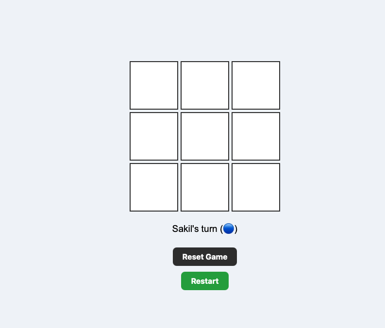
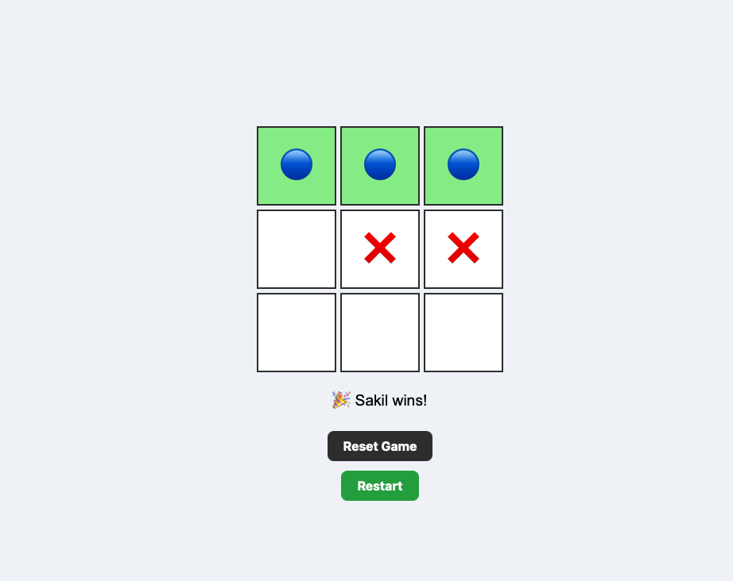
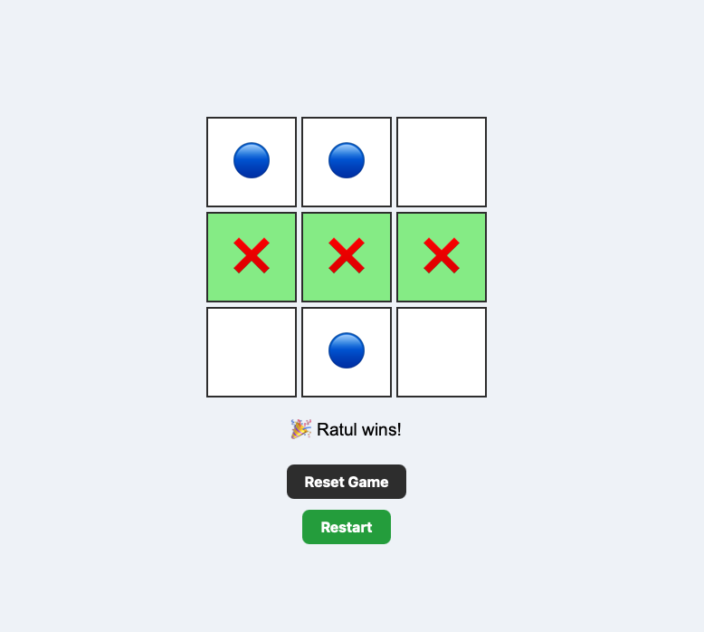

# Culs-Frontend-Project-25

# Tic Tac Toe Game

A simple Tic Tac Toe web game built with HTML, CSS, and JavaScript.
Players can enter their custom names, and each player is represented with a unique icon (🔵 / ❌).

### Project Link: https://engr-sakil.github.io/Culs-Frontend-Project-25/
## Features
- Enter custom player names before starting the game
- Start screen with input fields and Start button
- Interactive 3x3 grid with clickable cells
- Highlights the winning combination
- Reset button to clear the board while keeping players’ names
- Restart button to go back to the start screen and enter new names
- Responsive design for desktop and mobile
## How to Play
- Enter the names of Player 1 and Player 2.
- Click Start Game to reveal the board.
- Players take turns clicking empty cells to place their icon.
- The game detects a win or draw automatically.
- Use Reset to restart the round or Restart to enter new names.

## Screenshots

